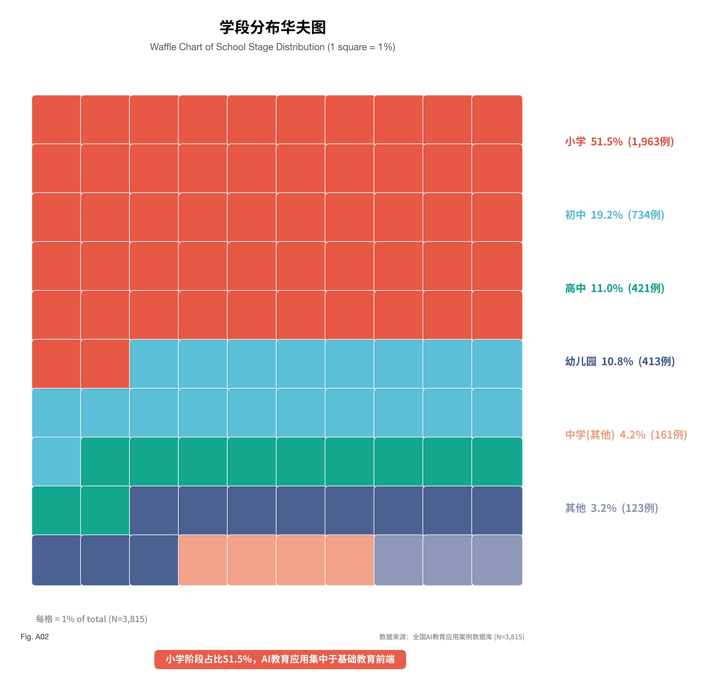
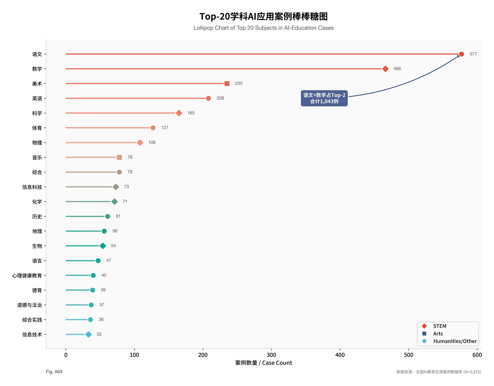
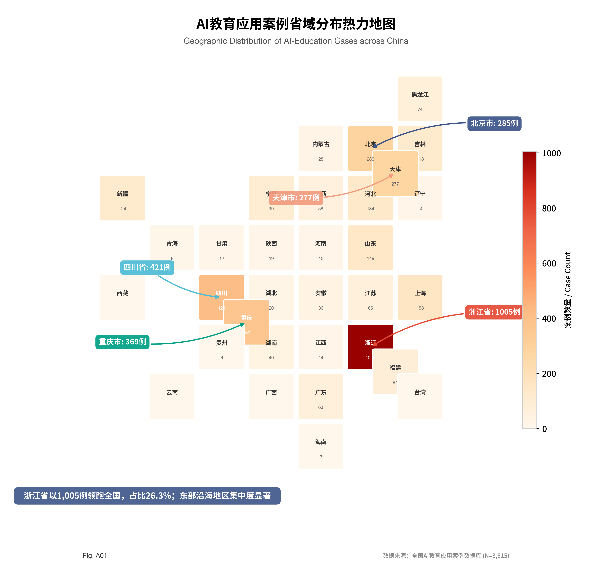
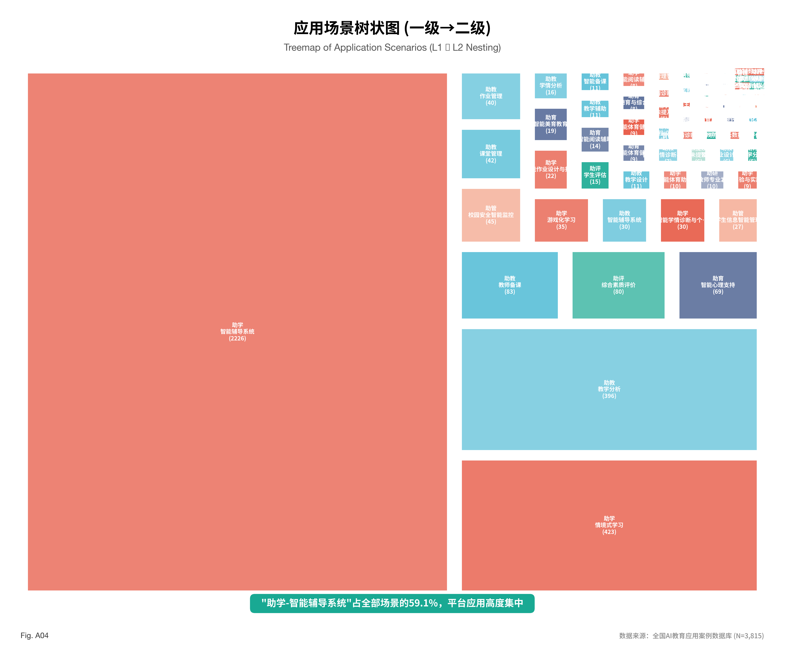

### 2.2 教育应用类产品应用现状综述

当前，人工智能赋能基础教育正经历从单点探索向系统性应用的跨越。基于对实证数据的深度挖掘，本节从学段学科渗透、区域空间分布与应用场景结构的三个核心维度，全景式呈现AI教育应用的发展现状。

#### 2.2.1 学段学科角度：应用现状感知

AI教育应用在不同学段与学科间的渗透呈现出显著的结构性差异与聚集特征（见图2、图3）：

**第一，通用基座模型的全域覆盖能力凸显。** 以豆包为代表的通用大模型产品在所有学段与学科中均呈现出极高的覆盖率。这表明，具备强大自然语言处理与多模态生成能力的跨领域大模型，已成为教育创新实践的基础设施。

**第二，小学阶段成为应用落地的核心“试验田”。** 数据表明，豆包、DeepSeek大模型、即梦AI、剪映AI以及希沃AI等头部产品，在小学阶段的应用频次与密度明显高于初高中等其他学段。如同华夫饼图中蓝色色块所占据的压倒性视觉主导地位一样，小学阶段（占比过半）相对灵活的教学评价环境为新技术的引入提供了宽松的土壤。

**第三，不同产品形态的学段适配性呈现分化。** 工具型与内容创作型产品（如图像生成、视频剪辑工具）高度集中于低学段，在学前教育和小学阶段应用最为密集；而提供系统级管理、学情诊断的平台型系统，则在对教学逻辑与知识体系要求更高的中高学段拥有更广泛的应用基础。在学科渗透的棒棒糖图中，这种工具倾向同样带来了视觉上的反差，例如AI图像生成技术使美术等非主干学科的圆点体量出现异军突起之势。

 

#### 2.2.2 区域角度：空间分布格局

从地理空间视角审视（见图1），AI教育应用的区域分布与地方数字经济发展水平及教育信息化基础高度同频，呈现出典型的梯队差异：

**第一，东部极化与“生态构建阶段”到来。** 在案例省域分布地图中，深色高频区域高度集中。DeepSeek大模型、即梦AI、豆包、文心大模型等在核心省份（北京、广东、江苏、浙江）呈现高密度集聚态势，标志着这些地区已经跨越了初期的“产品应用阶段”，全面迈入深度融合的“生态构建阶段”。

**第二，“多产品叠加”与“集群效应”显现。** 北京、广东、江苏、浙江等领先省份构筑了明显的“多产品叠加区”，即同一省份或区域的教育生态中，并行接入了多种基座模型，不仅应用数量庞大，且产品结构高度多元化。学习辅导类、内容创作类和底层平台类产品在此交织，形成了良性的“模型生态集群效应”。

**第三，西部地区的单点突破与规模困境。** 相比之下，西部地区的AI教育应用多数表现为零散的单点分布。尽管存在局部极具价值的创新实践案例，但整体上受限于基础设施与资源投入，其应用的规模化效益尚未完全形成。

#### 2.2.3 场景角度：核心应用结构

对案例应用场景的分类剖析揭示了当前AI赋能教育的深层次偏向（见图4）：

**首先，教育智能应用呈现显著的“助学主导”结构。** 绝大多数实践案例围绕学生个体的学习辅助展开。在应用场景树图中，“助学”类场景以压倒性的面积占据画面的核心位置，成为当前AI教育的最重要支柱。

**其次，“情境构建”与“智能辅导”成为核心路径。** 豆包、DeepSeek等大模型产品介入学生学习场景最主要的两种方式为：一方面协助教师高效构建虚拟情境与教学素材，另一方面直接作为AI Tutor为学生提供个性化的答疑与智能辅导机制。

**最后，教研场景的智能化渗透依然薄弱。** 值得关注的是，“助研”类智能产品尚未成为教育生态的主流发展方向，在所有场景中占比极小。教育评价、教学研究等更为复杂、更具专业深度的环节，亟待更具针对性的教育垂类模型与创新产品填补空白。

