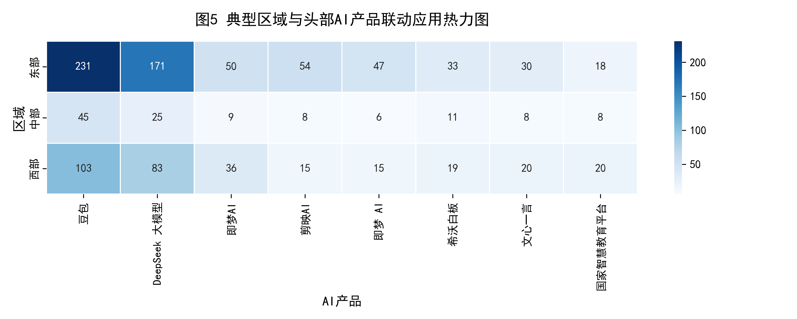
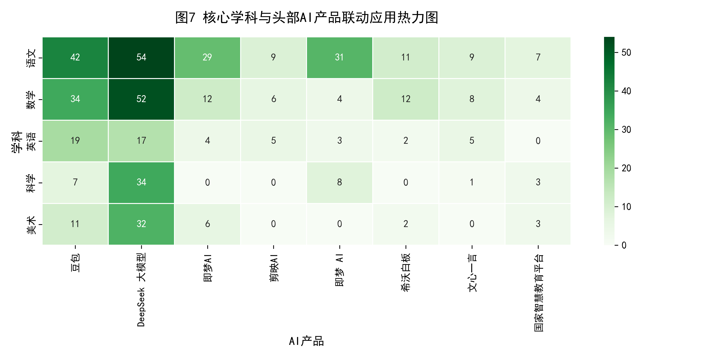

### 2.2 教育应用类产品应用现状综述

当前，人工智能赋能基础教育正经历从单点探索向系统性应用的跨越。基于对实证数据的深度挖掘，本节从学段学科渗透、区域空间分布与应用场景结构的三个核心维度，全景式呈现AI教育应用的发展现状。

#### 2.2.1 学段学科角度：应用现状感知

AI教育应用在不同学段与学科间的渗透呈现出显著的结构性差异与聚集特征（见图2、图3）：

**第一，通用基座模型的全域覆盖能力凸显。** 以豆包为代表的通用大模型产品在所有学段与学科中均呈现出极高的覆盖率。这表明，具备强大自然语言处理与多模态生成能力的跨领域大模型，已成为教育创新实践的基础设施。

**第二，小学阶段成为应用落地的核心“试验田”。** 数据表明，豆包、DeepSeek大模型、即梦AI、剪映AI以及希沃AI等头部产品，在小学阶段的应用频次与密度明显高于初高中等其他学段。如同华夫饼图中蓝色色块所占据的压倒性视觉主导地位一样，小学阶段（占比过半）相对灵活的教学评价环境为新技术的引入提供了宽松的土壤。

**第三，不同产品形态的学段适配性呈现分化。** 工具型与内容创作型产品（如图像生成、视频剪辑工具）高度集中于低学段，在学前教育和小学阶段应用最为密集；而提供系统级管理、学情诊断的平台型系统，则在对教学逻辑与知识体系要求更高的中高学段拥有更广泛的应用基础。在学科渗透的棒棒糖图中，这种工具倾向同样带来了视觉上的反差，例如AI图像生成技术使美术等非主干学科的圆点体量出现异军突起之势。

 

#### 2.2.2 区域角度：空间分布格局

从地理空间视角审视（见图1），AI教育应用的区域分布与地方数字经济发展水平及教育信息化基础高度同频，呈现出典型的梯队差异：

**第一，东部极化与“生态构建阶段”到来。** 在案例省域分布地图中，深色高频区域高度集中。DeepSeek大模型、即梦AI、豆包、文心大模型等在核心省份（北京、广东、江苏、浙江）呈现高密度集聚态势，标志着这些地区已经跨越了初期的“产品应用阶段”，全面迈入深度融合的“生态构建阶段”。

**第二，“多产品叠加”与“集群效应”显现。** 北京、广东、江苏、浙江等领先省份构筑了明显的“多产品叠加区”，即同一省份或区域的教育生态中，并行接入了多种基座模型，不仅应用数量庞大，且产品结构高度多元化。学习辅导类、内容创作类和底层平台类产品在此交织，形成了良性的“模型生态集群效应”。

**第三，西部地区的单点突破与规模困境。** 相比之下，西部地区的AI教育应用多数表现为零散的单点分布。尽管存在局部极具价值的创新实践案例，但整体上受限于基础设施与资源投入，其应用的规模化效益尚未完全形成。

#### 2.2.3 场景角度：核心应用结构

对案例应用场景的分类剖析揭示了当前AI赋能教育的深层次偏向（见图4）：

**首先，教育智能应用呈现显著的“助学主导”结构。** 绝大多数实践案例围绕学生个体的学习辅助展开。在应用场景树图中，“助学”类场景以压倒性的面积占据画面的核心位置，成为当前AI教育的最重要支柱。

**其次，“情境构建”与“智能辅导”成为核心路径。** 豆包、DeepSeek等大模型产品介入学生学习场景最主要的两种方式为：一方面协助教师高效构建虚拟情境与教学素材，另一方面直接作为AI Tutor为学生提供个性化的答疑与智能辅导机制。

**最后，教研场景的智能化渗透依然薄弱。** 值得关注的是，“助研”类智能产品尚未成为教育生态的主流发展方向，在所有场景中占比极小。教育评价、教学研究等更为复杂、更具专业深度的环节，亟待更具针对性的教育垂类模型与创新产品填补空白。

***

#### 2.2.4 三维交叉：典型产品联动分析

为了进一步揭示头部AI产品在不同维度的真实渗透率与适配特征，本节基于应用产品频次映射，从三大维度进行深度联动交叉验证。

**1. 区域 X 产品联动分析**
*   **东部地区**：呈现出双寡头与多模态并进的格局。豆包产品（231次）与DeepSeek大模型（171次）牢牢占据核心底层应用，同时剪映AI与即梦AI等音视频生成工具的普及率（合计超150次）显著高于中西部，反映了东部在多媒体创新教学上的超前探索。
*   **中部地区**：以通用大模型为主导，但专门化教育平台的地位上升。除豆包（45次）与DeepSeek（25次）外，希沃白板与国家智慧教育平台稳居前五，体现了中部地区对于常态化、低门槛数字化教学工具的刚需。
*   **西部地区**：应用生态呈现向头部集聚的“长尾坍缩”现象。豆包（103次）与DeepSeek（83次）的应用甚至在绝对数量上超过了中部样本，且文心一言紧接其后。这表明西部地区在资源受限的情况下，更倾向于采用国内知名度最高、使用门槛最低的头部通用大模型来赋能教学。

**2. 学段 X 产品联动分析**
*   **幼儿园（学前教育）**：应用生态显著区别于中小学。国家智慧教育平台与智学网等系统化平台的权重非常高，同时腾讯元宝等多样化模型也占据一席之地。由于学前教育无需应对严谨的学科考察任务，工具引入更为开放。
*   **小学**：核心创新试验田。豆包（194次）与DeepSeek（151次）的应用规模冠绝全场景。同时即梦AI/剪映等创作工具频次极高，表明小学阶段极其侧重利用AI进行情境化、趣味性的素材内容构建。
*   **初中**：延续了小学阶段的双寡头特征（豆包99次，DeepSeek87次），但创作类衍生工具的占比相对收缩，这反映了教学任务向知识讲解、习题辅导等硬核方向倾斜。
*   **高中**：应用格局发生反转。剪映AI（41次）反超基础大模型跃升至第一位。这可能与高中生更大概率自主使用创作工具进行探究性课题、社团活动，以及教师面临极高强度的微课制作压力紧密相关。

**3. 学科 X 产品联动分析**
*   **文科（语文/英语）**：自然语言大模型（DeepSeek、豆包）与多模态工具（即梦AI、剪映AI）的深度融合是主旋律。尤其在语文学科中，DeepSeek大模型与即梦AI结合使用（共计超100次呈现），常用于课文意境重绘与创意写作构建。
*   **理科（数学/科学）**：DeepSeek大模型在逻辑推理与理科场景中展现出绝对的统治力（数学52次，科学34次），远超其他模型。科学学科中通义千问等具备强代码/逻辑算力的模型也榜上有名。
*   **素养学科（美术）**：毫无意外地，图像生成与空间交互技术成为核心。除基础大模型提供创意构思外，即梦AI、VR设备等构建视觉与空间体验的专业工具占据了大量的实际课堂份额。

***

### 数据与代码使用说明（供核查参考）

为确保各项统计分析客观、精准溯源，本章节以上统计逻辑与作图说明如下：
*   **使用数据源**：本项目根目录下的 `new_reviews/V5.xlsx` 作为全量基础底表数据源。该表格为最新精洗的实体对齐数据，包含3815条工具级应用记录。
*   **本文交叉数据提取**：分析提取了V5表格中被标定为具体的 `区域`, `学段`, `学科` 字段，并将其与扁平化分布的 `工具标准名` 列进行了分组列联表计算（Crosstab）。对应提取脚本为 `src/calc_crosstabs.py`。
*   **本文引用图表绘图代码**：本文中引用的四大基础图表（华夫饼图、棒棒糖图、省域分布图、场景树图）的生成代码入口均位于 `src/viz_part1.py` 进行渲染；而它们所依赖的聚合统计数值，由核心统计算法脚本 `src/core_analysis.py` 从 V5 表格重新计算后存入 `output/*.json` 缓存文件中供给 `viz_part1.py` 使用。
